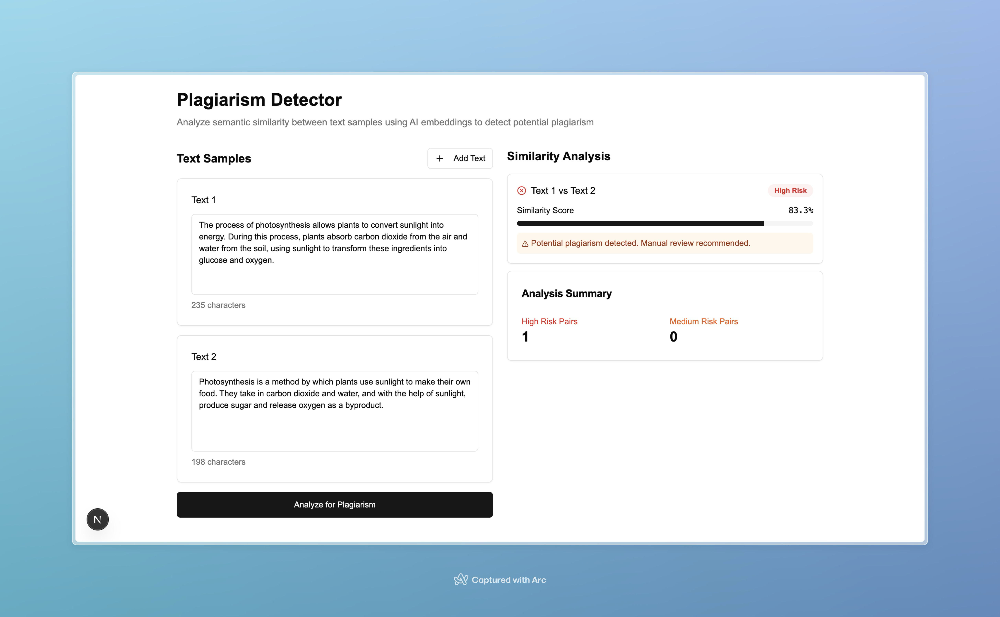

# Plagiarism Detector - Semantic Similarity Analyzer

This is a web-based tool that intelligently detects potential plagiarism by analyzing the semantic meaning of texts, not just by matching keywords. It's built with Next.js, TypeScript, and Tailwind CSS, and it uses AI embedding models from Hugging Face to understand the context and meaning of the provided text samples.



## How It Works

The application uses a concept from Artificial Intelligence called **"Embeddings"**. Think of an embedding as a unique "meaning fingerprint" for a piece of writing.

1.  **Generate Fingerprints:** When you input text, the AI model (specifically, `sentence-transformers/all-MiniLM-L6-v2`) reads it and generates this numerical meaning fingerprint.
2.  **Compare Fingerprints:** The application then mathematically compares the fingerprints of every text pair.
3.  **Score Similarity:** If two fingerprints are very similar, it means the original texts had a similar meaning, even if they used different words. This similarity is presented as a percentage, with high scores indicating potential plagiarism.

## Getting Started

Follow these instructions to get the project running on your local machine.

### Prerequisites

*   [Node.js](https://nodejs.org/en) (v18 or later)
*   `npm` (comes with Node.js)

### 1. Clone the Repository

First, clone this repository to your local machine.

```bash
git clone <your-repository-url>
cd <repository-folder>
```

### 2. Install Dependencies

This project has some known dependency conflicts, so it's best to install using the `--legacy-peer-deps` flag.

```bash
npm install --legacy-peer-deps
```

### 3. Set Up Environment Variables

The application requires a free API key from Hugging Face to work.

1.  **Create a `.env.local` file** in the root of the project.
2.  **Get your Hugging Face API Key:**
    *   Go to [huggingface.co/settings/tokens](https://huggingface.co/settings/tokens).
    *   Create a new token with **"read"** permissions.
    *   Copy the generated token.
3.  **Add the key** to your `.env.local` file like this:

    ```
    HUGGINGFACE_API_KEY=hf_xxxxxxxxxxxxxxxxxxxxxxxxxxxxxx
    ```

### 4. Run the Application

Start the Next.js development server.

```bash
npm run dev
```

Open your browser and navigate to `http://localhost:3000` to see the application.

## Example Usage

To see the plagiarism detector in action, try pasting the following examples into the text boxes.

**Text 1 (Original):**
> The process of photosynthesis allows plants to convert sunlight into energy. During this process, plants absorb carbon dioxide from the air and water from the soil, using sunlight to transform these ingredients into glucose and oxygen.

**Text 2 (Potential Plagiarism):**
> Photosynthesis is a method where plants use solar power to make their own food. They take in CO2 and H2O, and with the help of sunlight, they create sugar for energy and release oxygen as a byproduct.

**Text 3 (Different Topic):**
> The Industrial Revolution was a period of major industrialization that took place during the late 1700s and early 1800s. It began in Great Britain and quickly spread throughout the world, leading to massive changes in society.

When you run the analysis, you will see a very high similarity score between Text 1 and Text 2, while the scores for pairs involving Text 3 will be very low.
